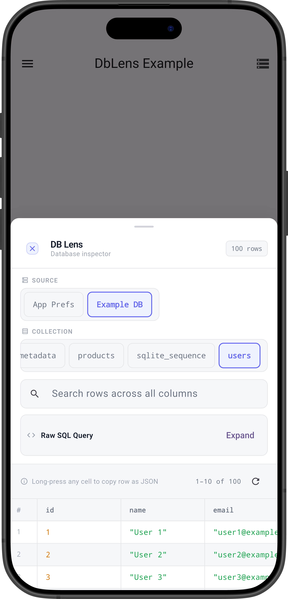
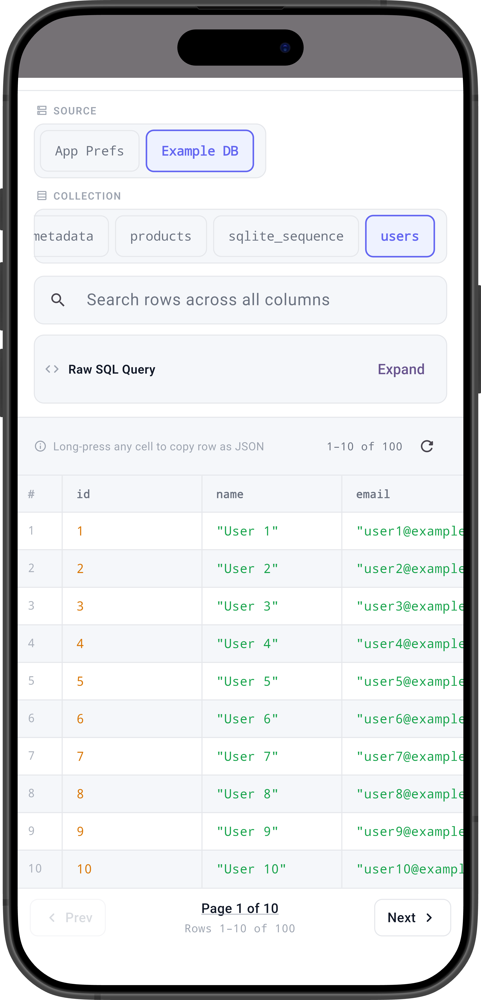
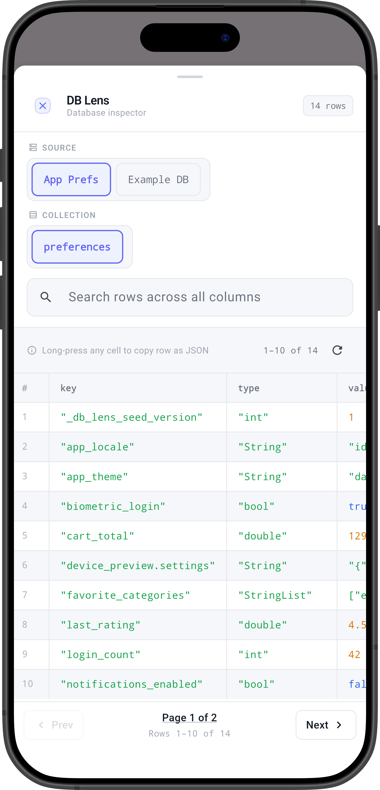

# db_lens 🔍

A Flutter debug tool for QA and developers to inspect SQLite (sqflite) and SharedPreferences directly on device — no external tools, no adb, no VS Code needed.

---

## Preview

| SQLite Browser | Pagination | SharedPreferences |
|:-:|:-:|:-:|
|  |  |  |

---

## Installation

```yaml
dev_dependencies:
  db_lens: ^0.0.2
```

---

## Usage

### 1. Register your database

```dart
import 'package:db_lens/db_lens.dart';

// SQLite
final db = await openDatabase('my_app.db');
DbLens.register('Main DB', db);

// SharedPreferences
final prefs = await SharedPreferences.getInstance();
DbLens.registerSharedPreferences('App Prefs', prefs);
```

### 2a. Use the ready-made button

Drop `DbLensButton` anywhere — drawer, settings page, debug menu, etc.

```dart
import 'package:db_lens/db_lens.dart';

// Default
DbLensButton()

// Custom
DbLensButton(
  label: 'Inspect Database',
  icon: Icons.bug_report,
)
```

### 2b. Or open manually

```dart
DbLens.open(context);
```

---

## Multiple Sources

```dart
DbLens.register('Main DB', mainDb);
DbLens.register('Cache DB', cacheDb);
DbLens.registerSharedPreferences('App Prefs', prefs);
```

Switch between them inside the panel.

---

## Features

- 🔍 Browse SQLite tables and SharedPreferences
- 🗄️ SharedPreferences inspector with key, type, and value columns
- 🔎 Search rows across all columns
- 📄 Pagination (10 rows/page)
- 🛠️ Raw SQL query support
- 🔄 Refresh data on demand
- 📋 Long-press cell to copy row as JSON
- 💾 Multiple source support
- 🎯 Flexible — use `DbLensButton` or call `DbLens.open(context)` manually
- 🚫 Auto-hidden in release builds