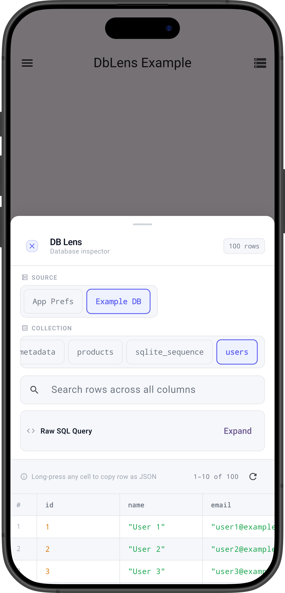
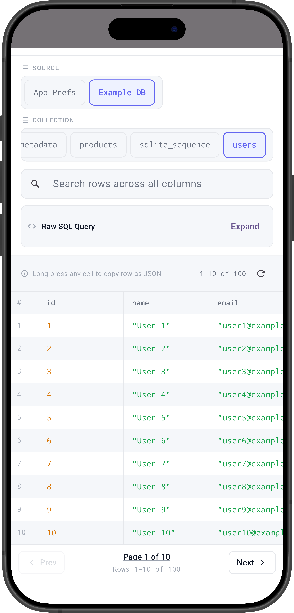
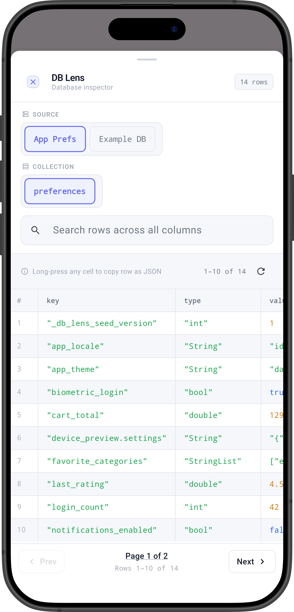

# db_lens 🔍

A Flutter **Database Inspector Framework** for inspecting SQLite and SharedPreferences directly on device — no adb, no external tools, no laptop needed.

> Designed for QA and developers. Works out of the box (`DbLens.open()`), or compose your own UI from headless controllers and reusable widgets. Hidden in release builds (`kReleaseMode`).

---

## Preview

| SQLite Browser | Pagination | SharedPreferences |
|:-:|:-:|:-:|
|  |  |  |

---

## Installation

```yaml
dev_dependencies:
  db_lens: ^1.0.2
```

---

## Quick Start

```dart
import 'package:db_lens/db_lens.dart';
import 'package:shared_preferences/shared_preferences.dart';
import 'package:sqflite/sqflite.dart';

// SQLite
final db = await openDatabase('my_app.db');
DbLens.register('Main DB', db);

// SharedPreferences
final prefs = await SharedPreferences.getInstance();
DbLens.registerSharedPreferences('App Prefs', prefs);

// Open the built-in inspector (bottom sheet by default)
DbLens.open(context);
```

---

## DbLensButton

Drop it anywhere — app bar, drawer, debug menu, settings page. Automatically hidden in release builds.

```dart
DbLensButton()

DbLensButton(
  label: 'Inspect Data',
  icon: Icons.bug_report,
  style: ElevatedButton.styleFrom(backgroundColor: Colors.teal),
)
```

---

## Presentation Modes

`DbLens.open()` supports two navigation modes via `DbLensConfig.presentationMode`:

```dart
// Bottom sheet (default)
DbLens.open(context);

// Full-screen route
DbLens.open(
  context,
  config: const DbLensConfig(
    presentationMode: DbLensPresentationMode.fullPage,
    fullscreenDialog: true,
  ),
);
```

To embed the inspector directly in your widget tree (e.g. a debug tab), use `DbLens.buildPanel()` instead — no navigation involved:

```dart
Scaffold(
  body: DbLens.buildPanel(
    theme: DbLensThemeData.fromMaterialTheme(Theme.of(context)),
  ),
)
```

---

## Custom UI

For full control, compose your own inspector from public widgets and sub-controllers:

```dart
DbLensControllerScope(
  theme: DbLensThemeData.fromMaterialTheme(Theme.of(context)),
  child: DbLensLayout(
    sidebar: const DbLensSourceList(),
    toolbar: const DbLensToolbar(actions: [DbLensRefreshAction()]),
    body: Builder(
      builder: (context) {
        final c = DbLensControllerScope.of(context);
        return AnimatedBuilder(
          animation: c.table,
          builder: (context, _) {
            final columns = c.activeColumns;
            return DbLensTableView(
              rows: c.visibleRows(columns: columns),
              columns: columns,
            );
          },
        );
      },
    ),
  ),
)
```

`DbLensController` is split into focused sub-controllers — use only what you need:

| Sub-controller | Responsibility |
|---|---|
| `controller.source` | Sources, collections, selection |
| `controller.table` | Rows, search, pagination |
| `controller.query` | Raw SQL mode |
| `controller.queryHistory` | Per-session SQL history |
| `controller.edit` | Cell editing |
| `controller.browse` | Browse-all-sources snapshot |

See [doc/custom_ui.md](doc/custom_ui.md) for the full composition guide, widget reference, direct data access API, and change history integration.

---

## Dynamic Theme

```dart
DbLens.open(
  context,
  theme: DbLensThemeData.fromMaterialTheme(Theme.of(context)),
);

// Or custom tokens
DbLens.open(
  context,
  theme: const DbLensThemeData(accent: Colors.teal),
);
```

---

## Multiple Sources

```dart
DbLens.register('Main DB', mainDb);
DbLens.register('Cache DB', cacheDb);
DbLens.registerSharedPreferences('App Prefs', prefs);
```

Switch between sources inside the panel. Search and filter source and collection lists in real time.

---

## Change History

Track insert/update/delete changes across registered collections (debug builds only).

Compose the header and panel separately — the header owns navigation, search/filter toggles, tracking, and clear; the panel owns the entry list.

```dart
DbLens.configureHistory(pollInterval: const Duration(seconds: 5));

final historyController = DbLens.createHistoryController();
await historyController.loadFor(sourceId);

// Modal bottom sheet (all tables)
await DbLensHistorySheet.show(
  context,
  controller: historyController,
  sourceName: 'Main DB',
);

// Modal bottom sheet scoped to one table
await DbLensHistorySheet.show(
  context,
  controller: historyController,
  sourceName: 'Main DB',
  table: 'users',
);

// Full-page route
Navigator.push(
  context,
  MaterialPageRoute(
    builder: (context) => Scaffold(
      body: Column(
        children: [
          DbLensHistoryHeader(
            controller: historyController,
            sourceName: 'Main DB',
            onBack: () => Navigator.pop(context),
          ),
          Expanded(
            child: DbLensHistoryPanel(
              controller: historyController,
              table: 'users', // optional — scope to one collection
            ),
          ),
        ],
      ),
    ),
  ),
);
historyController.dispose();
```

| Widget | Role |
|---|---|
| `DbLensHistoryHeader` | Title, optional back, search/filter toggles, tracking, clear |
| `DbLensHistoryPanel` | Entry list; optional `table` scope |
| `DbLensHistorySheet` | Bottom-sheet wrapper around header + panel |
| `DbLensHistoryEntryView` | Entry detail with diff or raw JSON + copy |

---

## Features

| | |
|---|---|
| 🗄️ | SQLite table browser with pagination |
| 🔑 | SharedPreferences inspector (`key`, `type`, `value`) |
| 🔎 | Search rows across all columns; searchable source & collection selectors |
| 📄 | Pagination (configurable via `DbLensConfig.pageSize`, default 10) |
| 🛠️ | Raw SQL query (SQLite); auto-select table on simple `SELECT` |
| 🎨 | Table / JSON view toggle — current page as pretty-printed JSON array |
| 📋 | Tap row → JSON bottom sheet; long-press → copy or edit cell |
| ✏️ | Edit cell values (SQLite `UPDATE` / SharedPreferences `set*`) |
| 📤 | Copy all rows as JSON |
| 📜 | Change history with diff view, filters, and copy JSON (polling-based) |
| 🧩 | Headless controllers + reusable widget library for custom UI |
| 🎨 | `DbLensThemeData` — customizable panel colors |
| 🔄 | Refresh on demand |
| 💾 | Multiple source support |
| 🔒 | No-op in release builds |

---

## Configuration

```dart
DbLens.open(
  context,
  config: const DbLensConfig(
    pageSize: 20,
    enablePrefetch: true,
    enableHistory: true,
    historyPollInterval: Duration(seconds: 5),
    presentationMode: DbLensPresentationMode.bottomSheet,
  ),
);
```

---

## Example App

Run the included example to try every integration pattern:

```bash
cd example
flutter run
```

Demos include bottom sheet, full page, embedded panel, custom UI composition, and change history. See [example/README.md](example/README.md).

---

## Migrating from 0.0.x

| 0.0.x | 1.0.0 |
|---|---|
| `DbLens.openPage()` | `DbLens.open(context, config: DbLensConfig(presentationMode: fullPage))` |
| `DbLens.openCustom()` | `DbLensControllerScope` + compose widgets yourself |
| `DbLensInspectorScope` | `DbLensControllerScope` |
| `DbLensPresentationMode.embedded` | `DbLens.buildPanel()` |
| `controller.sources` | `controller.source.sources` |
| `controller.searchText` | `controller.table.searchText` |
| `controller.pagination` | `controller.table.pagination` |

---

## License

See [LICENSE](LICENSE).
